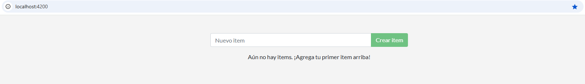
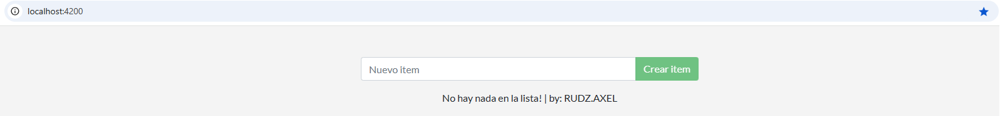

# Fundamentos y usos prácticos de Docker

## Entregable trabajo integrador: [Su nombre y apellido]


## Parte 1 - Conteinerizar una Aplicación


### Creando la imágen

- Ejecute el comando correspondiente para buildear la imágen. Elija un nombre de imágen y un tag acorde. 

    ```bash
    docker build -t app:v1.0-alpine app/.
    ```
- Muestre cuánto espacio ocupa la imaǵen una vez creada.

    ```bash
    docker images app:v1.0-alpine
    ```
- ¿Puede hacer algo para optimizar o mejorar la imágen?. Describa qué modificaciones puede hacer para optimizar la imágen.

#### _Cambios para optimizar la imagen_:
- Usar como imagen base **node:alpine** en vez de solo **alpine**.
- Concatenar las dos instrucciones **RUN**. De esa forma tendremos solo una capa en vez de dos.
- Reoganizar las lineas del docker file para aprovechar la cache.


### Correr la aplicación

Una vez creada la imágen, debería ser capaz de correr la aplicación.


- Ejecute un comando para poder correr la aplicación.
    ```bash
    docker run --rm -p 4200:3000 app:v1.0-alpine
    ```
- Explique el comando y cada parámetro enviado.
    - **Docker run**: crea y ejecuta un contenedor según la imagen proporcionada.
    - **--rm**: indica que debe borrar el contenedor al detenerse.
    - **-p 4200:3000**: indica que debe mapear el puerto 4200 del host con el 3000 del contenedor (donde está escuchando la app).
    
- Muestre una captura de pantalla o un copy-paste del contenedor corriendo.

    ```
    PS C:\Proyectos\docker-integradora> docker run --rm -p 4200:3000 app:v1.0-alpine
    Using sqlite database at /etc/todos/todo.db
    Listening on port 3000
    ```

- Adjunte una captura de pantalla con la aplicación funcionando con la URL utilizada para acceder.

    


## Parte 2 - Actualizar aplicación (imágen)

### 1. Actualizar el código fuente

- Ejecutemos los comando necesarios para que la aplicación tome los cambios. Realice un etiquetado (tag) coherente respecto a los cambios en la imágen
    
    ```bash
    docker build -t app:v1.1-alpine app/.  # Cambio de v1.0 a v1.1
    docker run --rm -p 4200:3000 app:v1.1-alpine
    ```

- Mostrar captura de pantalla con la app corriendo con las modificaciones realizadas.

    

> La actualizaciones realizadas, dejan a la primera versión obsoleta

### 2. Elimine el contenedor e imágen anterior

- Elimine la imágen y el contenedor hecho en el punto anterior

    ```bash
    docker rm ${NOMBRE_DEL_CONTENEDOR} # No es necesario debido a que usé el flag --rm anteriormente.
    docker image rm app:v1.0-alpine
    ```

- Liste las imágenes y contenedores para ver que ya no existen.

    ```bash
    docker ps -a # Para ver todos los contenedores
    docker image ls -a # Para listar todas las imagenes
    ```


## Parte 3 - Compartir app

Para compartir la imágen de la aplicación usaremos la registry de [DockerHub](https://hub.docker.com/).

> [!TIP]
> Repase lo realizado en el [Laboratorio 2.3](https://github.com/kity-linuxero/docker_410_practicas/blob/main/labs/02-conceptos-basicos/23-images-push.md#3-subimos-a-la-registry).


- Escriba los comandos necesarios para que sea posible subir la imaǵen correctamente.

    ```bash
    docker image tag app:v1.1-alpine axelrudz/app:v1.1-alpine
    docker login
    docker push axelrudz/app:v1.1-alpine
    ```

- Comparta la URL de DockerHub para que pueda ser posible probar y descargar su imágen.

    [Link de la imagen](https://hub.docker.com/r/axelrudz/app)

- Agregue un _overview_ para el repositorio de Dockerhub con instrucciones para correr la imágen y todo lo que considere necesario para que un tercero pueda ejecutar la imágen.

> [!TIP]
> Utilice el formato [markdown](https://docs.github.com/es/get-started/writing-on-github/getting-started-with-writing-and-formatting-on-github/basic-writing-and-formatting-syntax) para darle formato al overview.


## Parte 4 - Persistencia de datos

Los datos en esta APP se guardan en un archivo `/etc/todos/todo.db`.

- Escriba los comandos utilizados para realizar lo solicitado con la explicación correspondiente.

    ```bash
    docker volume create todo_data # Se puede omitir este paso, el volumen se creara automaticamente en el siguiente comando
    docker run --rm -p 4200:3000 -v todo_data:/etc/todos axelrudz/app:v1.1-alpine
    ```

- Decida que tipo de persistencia es la adecuada para la app.
    - _Considero conveniente usar un volúmen. Son más fáciles de gestionar, más seguros y más portables. Las ventajas del bind mount no se aprovecharían, ya que solo queremos guardar datos simples que perfectamente podrían estar aislados._

> [!TIP]
> Repase [volúmenes y persistencia](https://docker.idepba.com.ar/clase4.html#/volumenes) de datos.


## Parte 5 - Aplicaciones multicontainer


- [Crear una red](https://docker.idepba.com.ar/clase4.html#/network_create) para conexión entre los contenedores que servirá también para conectar a la aplicación.

    ```bash
    docker network create mi_red # Por defecto crea una red de tipo bridge
    ```
- [Crear un nuevo volumen](https://docker.idepba.com.ar/clase4.html#/volume_create) para persistir los datos de la base MySQL. El path donde se almacenan los datos en el contenedor MySQL es `/var/lib/mysql`.
    
    ```bash
    docker volume create mysql_data
    ```
- Iniciar el contenedor de la aplicación utilizando el comando `docker run` enviando las variables de entornos necesarias para la conexión con la base de datos.

    ```bash
    docker run --name mysql-container -v mysql_data:/var/lib/mysql --network mi_red -e MYSQL_ROOT_PASSWORD=mipassword -e MYSQL_DATABASE=todo mysql:8.0
    docker run --name todo-container -v todo_data:/etc/todos --network mi_red -e MYSQL_HOST=mysql-container -e MYSQL_USER=root -e MYSQL_PASSWORD=mipassword -e MYSQL_DB=todo -p 4200:3000 axelrudz/app:v1.1-alpine
    ```

> [!TIP]
> Set environments variables (-e, --env) [Docker Docs](https://docs.docker.com/reference/cli/docker/container/run/#env).


## Parte 6 - Utilizando Docker Compose

En la carpeta raíz del proyecto, cree un archivo de docker compose `compose.yml` o `docker-compose.yml`. Adicionalmente pégue el contenido del archivo `compose` en este lugar:

```compose
# Copie aquí el contenido del archivo compose.
```

> [!IMPORTANT]  
> El instructor debe ejecutar el comando `docker compose up` y la aplicación debe descargarse y ejecutarse correctamente.

----


<p align="center">
  
</p>


